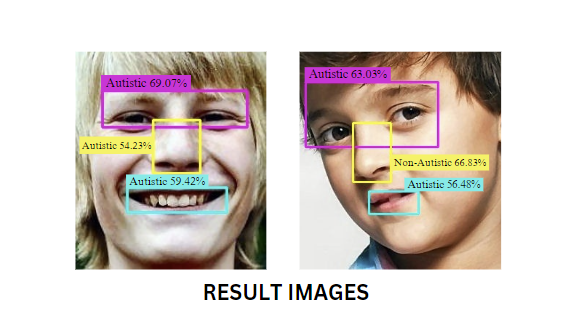

## AUTISM DETECTION USING DIFFERENT FACIAL FEATURES


• This repository contains autism detection using different facial features based upon classification.

• We have created 3 different dataset for classification of facial features.
    - Autistic and non-autistic eyes
    - Autistic and non-autistic nose
    - Autistic and non-autistic lips
We have used Dlib to extract these facial features and
stored the extracted datasets in the Data folder. 

#### DATA FOLDER
• This folder consists of 4 subfolders-
    - Faces - Contains the whole dataset of autistic and non-autistic children faces divided into Test,Train and Valid.
    - Train - Contains the test images for particular features of eyes,nose and lips.
    - Valid - Contains the images for validation for particular features of eyes,nose and lips.
    - Test - Contains the images for testing for particular features of eyes, nose and lips.

<p align="center">  </p> 
<p align="center">  </p> 

For Autistic and non-Autistic Eyes,Nose and Lips classification we have used VisionTransformer with pretrained weights in pretrained_weights directory.
The saved models has been placed in model_checkpoint.


• For testing the results of the model, run the following command.
```bash
python test_main.py
```
This file first loads all the three classification models trained using VisionTransformer architecture then uses Dlib facial features extractor to extract landmarks for eyes,nose and lips. 

Then the extracted images are passed through each individual models to predict that the particular eyes,nose and lips are Autistic or non-autistic.

After running the test_main.py file, the result would be saved in Results folder for both autistic and non-autistic image folder prdictions.

Each image contains a bounding boxes around their eyes,nose and lips with the predicted outcome over it.
Results example are as follows.


<p align="center">  </p> 
